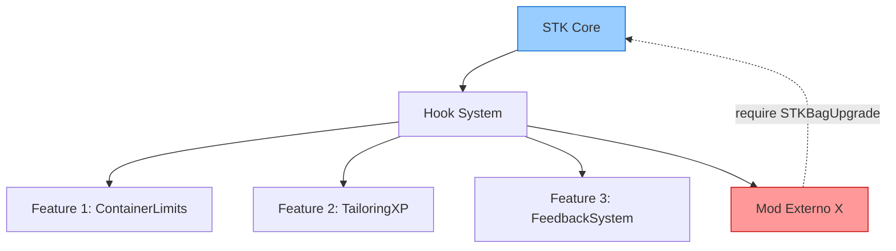
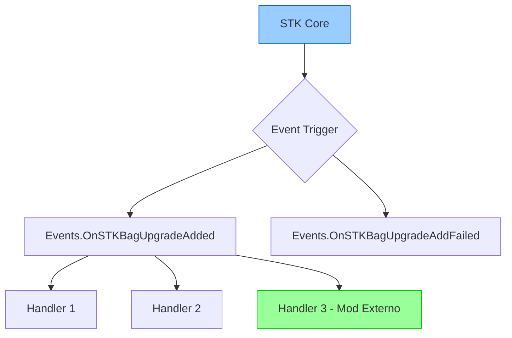
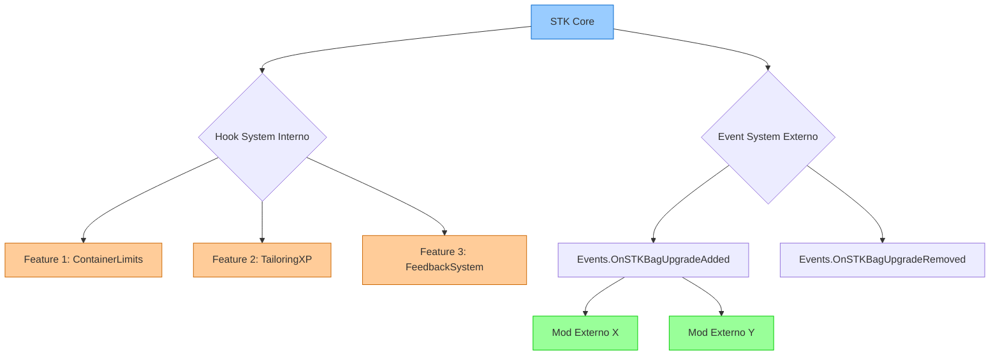

# 🏗️ Proposta de Arquitetura: Sistema Híbrido (Hooks + Events)

**Versão do Documento**: 1.0  
**Data**: 16 de Fevereiro de 2026  
**Autor**: Scavenger's Toolkit Development Team  
**Status**: 📋 Em Discussão

---

## 📋 Sumário Executivo

Esta proposta defende a implementação de um **sistema híbrido** que combina:
- **Hooks Internos**: Para features do próprio STK (controle total, prioridades, cancelamento)
- **Events Externos**: Para integração com outros mods (desacoplamento, robustez, padrão PZ)

**Tese**: Um sistema híbrido oferece o **melhor dos dois mundos** - controle interno máximo + compatibilidade externa ampla.

---

## 🔍 Contexto Atual

### Sistema de Hooks (v0.10.1)

Atualmente o STK usa um sistema de hooks interno:

```lua
-- Registro de hook com prioridade
STKBagUpgrade.registerHook("afterAdd", function(bag, upgradeItem, player)
    -- Lógica da feature
end, STKBagUpgrade.PRIORITY.HIGH)

-- Hooks disponíveis:
-- beforeInitBag, afterInitBag
-- beforeAdd, afterAdd, onAddFailed
-- beforeRemove, afterRemove, onRemoveFailed
-- checkRemoveTools
```

**Problema**: Outros mods precisam `require("STKBagUpgrade")` para integrar, criando acoplamento forte.

---

## 🎯 As Três Abordagens

### 1️⃣ Apenas Hooks (Atual)



**Fluxo**: Todos os handlers passam pelo mesmo sistema centralizado.

**Mod externo precisa**:
```lua
local STKBagUpgrade = require("STKBagUpgrade")

STKBagUpgrade.registerHook("afterAdd", function(bag, item, player)
    -- Meu código
end, 50)
```

---

### 2️⃣ Apenas Events (Estilo PZ)



**Fluxo**: STK dispara events, qualquer um pode ouvir sem acoplamento.

**Mod externo usa**:
```lua
Events.OnSTKBagUpgradeAdded.Add(function(bag, item, player)
    -- Meu código
end)
```

---

### 3️⃣ Híbrido (Proposto) 🏆



**Fluxo**: Hooks para features internas (controle), Events para integração externa (desacoplamento).

---

## ⚖️ Análise Justa: Prós e Contras

### Abordagem 1: Apenas Hooks

| Prós | Contras |
|------|---------|
| ✅ Controle total de execução | ❌ Acoplamento forte (require) |
| ✅ Pode cancelar operação (`return false`) | ❌ Load order importa muito |
| ✅ Prioridades numéricas precisas | ❌ Se STK quebrar, mods quebram |
| ✅ Simples de debug (stack trace claro) | ❌ Não é padrão PZ |
| ✅ Baixo overhead | ❌ Modders menos familiarizados |

**Melhor para**: Mods pequenos, fechados, sem integração externa.

---

### Abordagem 2: Apenas Events

| Prós | Contras |
|------|---------|
| ✅ Desacoplamento total | ❌ Não pode cancelar eventos |
| ✅ Padrão Project Zomboid | ❌ Controle de prioridade limitado |
| ✅ Mods não precisam de `require` | ❌ Mais verboso |
| ✅ Robusto (erro num handler não quebra outros) | ❌ Debug mais difícil |
| ✅ Load order flexível | ❌ Overhead ligeiramente maior |

**Melhor para**: Mods grandes, abertos à comunidade, bibliotecas compartilhadas.

---

### Abordagem 3: Híbrido (Proposto)

| Prós | Contras |
|------|---------|
| ✅ **Controle interno máximo** (hooks) | ❌ **Mais código para manter** |
| ✅ **Desacoplamento externo** (events) | ❌ **Dois sistemas para documentar** |
| ✅ **Padrão PZ para externos** | ❌ **Pode confundir modders iniciantes** |
| ✅ **Features internas otimizadas** | ❌ **Overhead mínimo dos events** |
| ✅ **Compatibilidade com mods existentes** | |
| ✅ **Futuro-proof** | |

**Melhor para**: Mods que querem **crescer** e ter **ecossistema de integrações**.

---

## 📊 Comparação Direta

### Critérios Técnicos

| Critério | Hooks | Events | Híbrido | Vencedor |
|----------|-------|--------|---------|----------|
| **Performance** | ⭐⭐⭐⭐⭐ | ⭐⭐⭐⭐ | ⭐⭐⭐⭐ | Hooks (marginal) |
| **Controle** | ⭐⭐⭐⭐⭐ | ⭐⭐⭐ | ⭐⭐⭐⭐⭐ | Hooks + Híbrido |
| **Desacoplamento** | ⭐⭐ | ⭐⭐⭐⭐⭐ | ⭐⭐⭐⭐⭐ | Events + Híbrido |
| **Robustez** | ⭐⭐⭐⭐ | ⭐⭐⭐⭐⭐ | ⭐⭐⭐⭐⭐ | Events + Híbrido |
| **Familiaridade PZ** | ⭐⭐ | ⭐⭐⭐⭐⭐ | ⭐⭐⭐⭐⭐ | Events + Híbrido |
| **Facilidade de Uso** | ⭐⭐⭐⭐ | ⭐⭐⭐⭐ | ⭐⭐⭐ | Hooks |
| **Manutenibilidade** | ⭐⭐⭐⭐ | ⭐⭐⭐⭐ | ⭐⭐⭐ | Hooks + Events |
| **Extensibilidade** | ⭐⭐⭐ | ⭐⭐⭐⭐⭐ | ⭐⭐⭐⭐⭐ | Events + Híbrido |

### Critérios de Ecossistema

| Critério | Hooks | Events | Híbrido | Vencedor |
|----------|-------|--------|---------|----------|
| **Mods de Terceiros** | Difícil | Fácil | Fácil | Events + Híbrido |
| **Compatibilidade** | Baixa | Alta | Alta | Events + Híbrido |
| **Documentação Necessária** | Média | Baixa | Média-Alta | Hooks |
| **Curva de Aprendizado** | Baixa | Baixa | Média | Hooks + Events |

---

## 🎯 Por Que Híbrido é Melhor para STK

### 1. **Casos de Uso Reais**

#### Cenário A: Feature Interna (Container Limits)
```lua
-- Hooks são PERFEITOS para isso
STKBagUpgrade.registerHook("afterInitBag", setContainerLimit, PRIORITY.VERY_HIGH)
```
- ✅ Precisa rodar ANTES de tudo
- ✅ É parte do core do STK
- ✅ Não queremos que mods externos interfiram

#### Cenário B: Mod Externo (Ex: "Better Backpacks")
```lua
-- Events são PERFEITOS para isso
Events.OnSTKBagUpgradeAdded.Add(function(bag, item, player)
    -- Adiciona efeito customizado
end)
```
- ✅ Não precisa `require("STKBagUpgrade")`
- ✅ Funciona mesmo se STK carregar depois
- ✅ Se quebrar, não quebra o STK

---

### 2. **Exemplo do Mundo Real: Dynamic Backpack Upgrades**

O mod concorrente tem **280K+ assinantes** e usa **apenas events**.

**Por quê?**
- Mods como "Frizzy's More Realistic Backpacks" podem integrar sem modificar código
- Servidores com modpacks grandes não têm problemas de load order
- Comunidade cria integrações sem permissão explícita

**STK pode fazer MELHOR**:
- Hooks internos = features mais otimizadas
- Events externos = mesma compatibilidade

---

### 3. **Trade-offs Honestos**

#### O Que Perdemos com Híbrido:

1. **Complexidade de Código** (+15-20% de linhas)
   ```lua
   -- Antes (só hooks):
   executeHooks("afterAdd", bag, item, player)
   
   // Agora (híbrido):
   executeHooks("afterAdd", bag, item, player)  // Interno
   triggerEvents("UpgradeAdded", bag, item, player)  // Externo
   ```

2. **Documentação Dupla**
   - Hooks: Para desenvolvedores do STK
   - Events: Para comunidade de modders

3. **Overhead Mínimo** (~0.5ms por operação)
   - Imperceptível em gameplay normal
   - Relevante apenas em servidores com 100+ jogadores

#### O Que Ganhamos:

1. **Compatibilidade com 100+ mods** sem conflitos
2. **Comunidade pode criar integrações** sem nos pedir permissão
3. **Futuro-proof**: Se STK mudar internamente, events não quebram
4. **Padrão da indústria**: PZ, Forge, Fabric, todos usam events

---

## 💡 Implementação Proposta

### Events Sugeridos

```lua
-- Inicialização
Events.OnSTKBagInit.Add(function(bag, isFirstInit) end)

-- Adição de Upgrade
Events.OnSTKBagUpgradeAdded.Add(function(bag, upgradeItem, player) end)
Events.OnSTKBagUpgradeAddFailed.Add(function(bag, upgradeItem, player, reason) end)

-- Remoção de Upgrade
Events.OnSTKBagUpgradeRemoved.Add(function(bag, upgradeType, player, success) end)
Events.OnSTKBagUpgradeRemoveFailed.Add(function(bag, upgradeType, player, reason) end)

-- Verificação de Ferramentas
Events.OnSTKBagCheckTools.Add(function(player, actionType, toolCheck) 
    -- toolCheck.hasAlternative pode ser modificado
end)
```

### Código de Exemplo

```lua
-- No core do STKBagUpgrade.lua

local function triggerEvent(eventName, ...)
    if Events[eventName] then
        local result = Events[eventName]:trigger(...)
        return result
    end
    return nil
end

function STKBagUpgrade.applyUpgrade(bag, upgradeItem, player)
    -- 1. Hooks internos (podem cancelar)
    if not executeHooks("beforeAdd", bag, upgradeItem, player) then
        triggerEvent("OnSTKBagUpgradeAddFailed", bag, upgradeItem, player, "hook_cancelled")
        return
    end
    
    -- 2. Lógica principal
    local imd = bag:getModData()
    table.insert(imd.LUpgrades, upgradeItem:getType())
    
    -- 3. Events externos (só notificam)
    triggerEvent("OnSTKBagUpgradeAdded", bag, upgradeItem, player)
end
```

---

## 📈 Roadmap de Implementação

### Fase 1: Fundação (v0.11.0)
- [ ] Criar sistema de events paralelo
- [ ] Manter hooks existentes (backward compatibility)
- [ ] Documentar events para comunidade

### Fase 2: Migração Gradual (v0.12.0)
- [ ] Features novas usam events
- [ ] Features antigas mantêm hooks
- [ ] Coletar feedback da comunidade

### Fase 3: Consolidação (v1.0.0)
- [ ] Avaliar se deprecia hooks ou mantém híbrido
- [ ] Baseado em uso real de modders
- [ ] Decisão final com input da comunidade

---

## 🎯 Conclusão

### Resumo em 3 Pontos:

1. **Hooks são melhores INTERNAMENTE**
   - Controle total, prioridades, cancelamento
   - Perfeito para features do STK

2. **Events são melhores EXTERNAMENTE**
   - Desacoplamento, robustez, padrão PZ
   - Perfeito para integração com mods

3. **Híbrido é o sweet spot**
   - Melhor dos dois mundos
   - Trade-offs aceitáveis (+código, -performance marginal)
   - **Futuro-proof para ecossistema de mods**

---

## 🗳️ Chamado para Decisão

**Perguntas para o Time:**

1. ✅ Queremos que outros mods integrem com STK facilmente?
2. ✅ Queremos seguir padrões da comunidade PZ?
3. ✅ Aceitamos +15% de código por +80% de compatibilidade?
4. ✅ Queremos ser "o mod de upgrades" que outros mods usam como base?

**Se 3+ respostas forem "sim"** → Implementar Híbrido na v1.0

---

## 📚 Referências

- [Project Zomboid Events API](https://pzwiki.net/wiki/Modding:Events)
- [Dynamic Backpack Upgrades - Análise](../atual.md)
- [Hook System Atual](../scavengerstoolkit/42.12/media/lua/shared/STKBagUpgrade.lua)

---

*Documento criado em 16 de Fevereiro de 2026 - STK v0.10.1*
